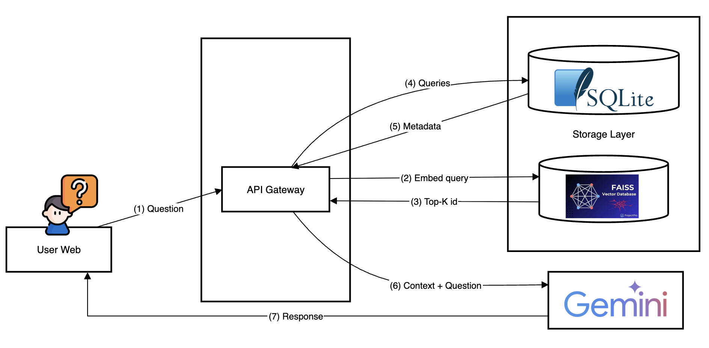

# Weekly Schedule Chatbot (Self-hosted RAG with FAISS + SQLite)

**Chức năng**: Tự lưu trữ Vector DB (FAISS) + SQLite metadata, dùng OpenAI Embeddings để trả lời mọi câu hỏi về **lịch tuần (.docx)** 

## Thành phần
- `parse_schedule.py`: trích dữ liệu từ `.docx` thành JSONL (mỗi sự kiện 1 dòng), cố gắng bóc tách **ngày, giờ, địa điểm, TP...** (có thể không hoàn hảo, bạn tinh chỉnh regex tuỳ file).
- `ingest_faiss.py`: chunk dữ liệu, tạo **embedding** bằng OpenAI, lưu vào **FAISS** (`rag_store/index.faiss`) và **SQLite** (`rag_store/chunks.sqlite`) để tra metadata.
- `server_faiss.py`: API FastAPI `/ask` → embed câu hỏi → tìm Top-K trong FAISS → nhét vào prompt → gọi LLM trả lời (tiếng Việt, không bịa).

## Cài đặt nhanh

```bash
python -m venv .venv && source .venv/bin/activate   # (Windows: .venv\Scripts\activate)
pip install -r requirements.txt

cp .env.example .env
# Mở .env và điền OPENAI_API_KEY=sk-...

# Chạy Web

uvicorn backend.main:app --reload --port 8000

#Tạo tài khoản, thêm biến sau trong .evn:
ADMIN_USER=...
ADMIN_PASS=...
```
